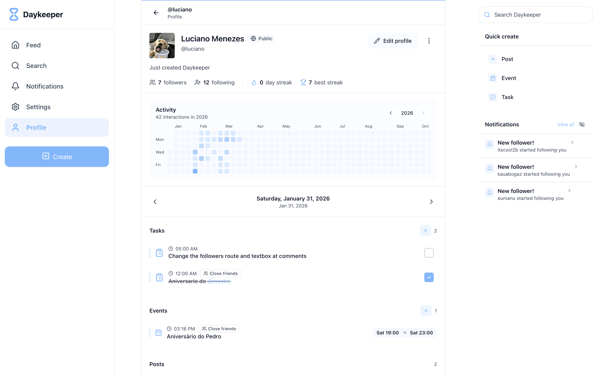
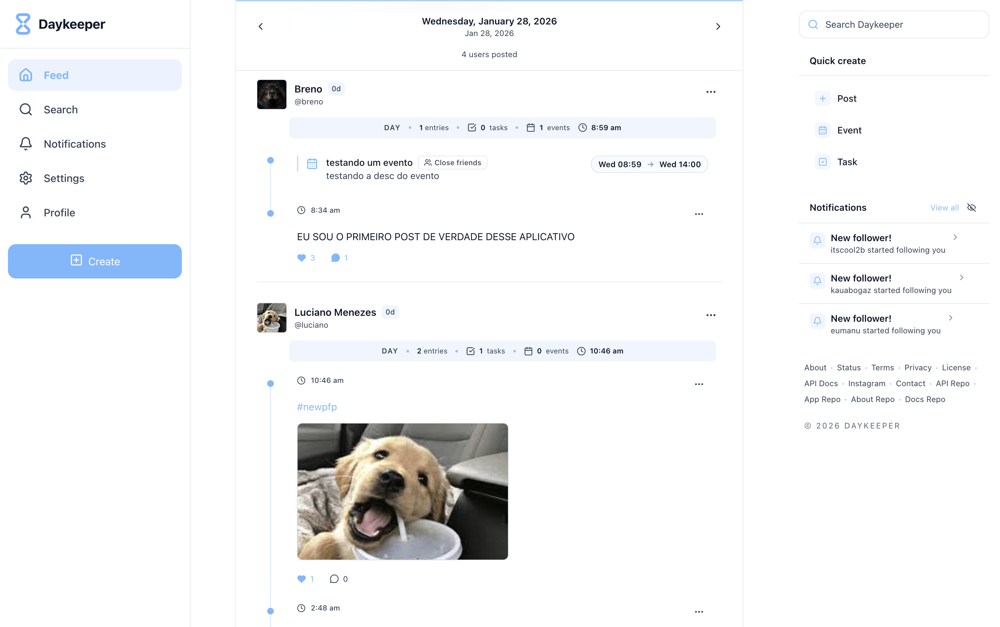

# Daykeeper

  

  Turning days into something you can actually look back on.

---

# NOTE: all daykeeper-related repositories are in my personal account

I made this decision to avoid the costs associated with deployment plans and to clearly reflect that the entire project was developed independently by me

---

Daykeeper is a timeline-based system where everything revolves around a single unit: the day.

Instead of losing information in an infinite feed, posts, tasks, notes, and events are all tied to specific dates, creating a structured history you can revisit over time.

It sits between a social network, a personal diary, and a planner, but the core idea is simple:
your life should be navigable, not disposable.

---

  
  

---

## Structure

This organization contains the full Daykeeper system:

* **daykeeper-api** → backend (Node.js, MongoDB, media + timeline logic)
* **daykeeper-webapp** → frontend (Next.js, timeline-based UI)
* **daykeeper-docs** → architecture and technical notes
* **daykeeper-about** → public-facing site

Each repository is separated intentionally to keep the system modular and easier to evolve.

---

## Status

* actively developed
* architecture defined, product still evolving
* focused on building a consistent timeline experience

---

## Author

Daykeeper is a personal project created and developed by Luciano Menezes.

This organization reflects the structure of the system, but the product, architecture, and implementation have been built and iterated independently.

---

  Not everything needs to disappear after you scroll past it.

